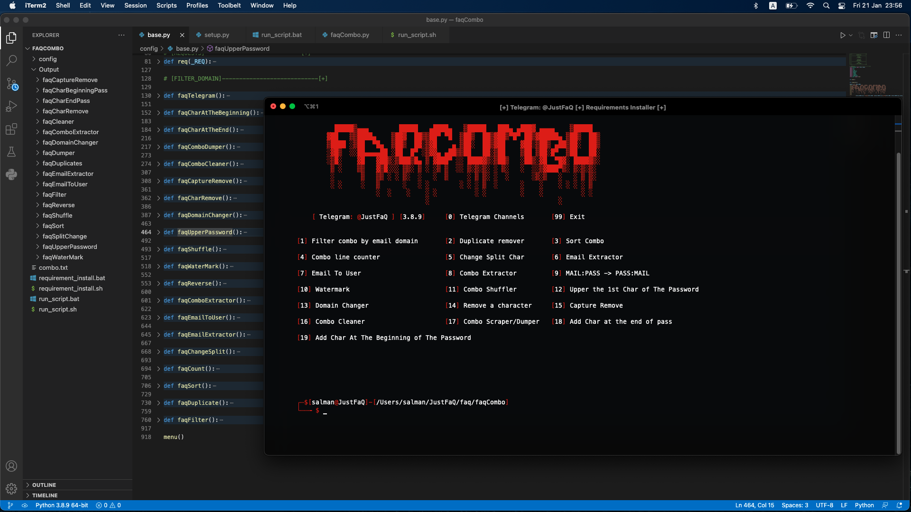

<h1 align="center">
  </a>
  <br>
</h1>

<h4 align="center">Advanced All In One Combo Tool.</h4>

<p align="center">
  <a href="#features">Features</a> •
  <a href="#installation">Install</a> •
  <a href="#running-faqCombo">Usage</a> •
</p>

---


faqCombo is tool that developed by Salman Alwan aka JustFaQ to save your time editing your combo, it has all the options that anyone needs in their life. You may face some problems, feel free to edit the code. More tools will be added soon, Leave some ideas on my telegram, @JustFaQ.

# Features

<h1 align="left">
  </a>
  <br>
</h1>

 - powerful tool
 - super cool ui

 # Usage

<h2>Windows: </h2>

```sh
requirement_install.bat
run_script.bat
```

<h2>Other: </h2>

```sh
requirement_install.sh
run_script.sh
```
This will setup/run the tool.

<h1 align="left">
  </a>
  <br>
</h1>


# Installation

faqCombo requires:
- python
- colorama
- requests
- datetime
- codecs
- isort
- webbrowser
- getpass

To install run these comands:

<h2>Windows: </h2>

```sh
▶ git clone https://github.com/JustFaQ/faqCombo.git
```
```sh
▶ cd faqCombo
▶ requirement_install.bat
▶ run_script.bat
```

<h2>Other: </h2>

```sh
▶ sudo apt install git
```
```sh
▶ git clone https://github.com/JustFaQ/faqCombo.git
```
```sh
▶ cd faqCombo
▶ requirement_install.sh
▶ run_script.sh
```

# Running faqCombo

To run the tool, just use the following command.

<h2>Windows: </h2>

```sh
▶ requirement_install.sh
▶ run_script.sh
```

<h2>Other: </h2>

```sh
▶ requirement_install.sh
▶ run_script.sh
```

